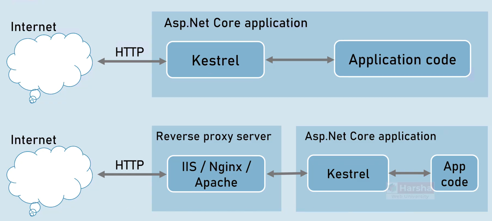

# ASP.Net Core 9


## 介绍

1. 跨平台
2. 可以创建任何规模的Web应用, 包括小型/中型和复杂应用, 以及创建Rest API服务
3. Asp .NET Core 默认使用Kestrel作为应用服务器, 其他反向代理包括 IIS, Nginx, Docker
4. 开源的 `https://github.com/dotnet/aspnetcore`
5. 开箱即支持 Microsoft Azure云服务
6. ASP.NET Core 包含四个部分
   * Asp.Net Core Mvc 大多数Web应用都是它开发的, 但这不应该与早期的 Asp.Net MVC混淆, 当你在Asp.NET Core 中使用模型, 视图, 控制器 模式时, 就称为 Asp.Net Core MVC
   * Asp.Net Core Web API 当你只创建包含模型的控制器但是没有视图, 则称为Asp.NET Core Web API, 通常 Asp.NET Core Web API 用于创建RESTful服务, 接收请求并以数据形式返回响应, 搭配单独的前端如 Vue, React
   * Asp.Net Core Razor Pages 服务于简单且以页面为中心的场景
   * Asp.Net Core Blazor 如果开发团队希望在服务器端与客户端都仅使用C#语言, 则更倾向于使用Asp.NET Core Blazor

## 比较

Asp.Net Web Forms    2002

* 主要存在性能劣势, 由于服务器状态和视图状态, 它的性能较慢, 因为Asp.Net WebForms 本身试图使Web变为有状态而非无状态, 这意味着每个页面都需要存储状态, 对于大型项目来说这非常消耗资源
* 不开源

Asp.Net Mvc    2009

* 是建立在早期为Asp.Net WebForms 开发的一些组件上的. 例如`system.web.dll`它在某些方法提供了部分较慢的性能并且缺乏对跨平台的支持, 与.NET框架的某些组件紧密耦合, 使得在其他操作系统上托管变得异常困难
* 开源 但 .Net Framework 不开源 (Asp.Net Mvc 基于 .Net Framework工作)
* 选择性添加依赖注入

Asp.Net Core    2016

* 跨平台, 因为Asp.Net Core 基于.Net Core工作, 它也是跨平台的,  支持云服务
* 开源 且 .Net Core 开源
* 内置依赖注入

# MyFirstApp

## Program.cs

```c#
var builder = WebApplication.CreateBuilder(args);// 加载配置, 环境, 默认服务
var app = builder.Build();

app.MapGet("/", () => "Hello World!");// 收到请求 / 时, 响应 hellowrold

app.Run();// 启动
```


## Kestrel And Other Servers

Kestrel是Asp.Net Core 默认的跨平台Http服务器, 它既充当开发服务器, 也作为能够接收真实互联网请求的实际应用服务器.
但是在实际中 大多数的情况下 Kestrel仅作为开发服务器和应用服务器, 在生产环境中会使用反向代理服务器

即你会编写一些Asp.Net Core 代码, 并通过默认服务器Kestrel运行应用进行测试, 开发完成后需要将代码部署到能够接收全球互联网请求的生产服务器, 此时Kestrel作为应用服务器运行, 而你会使用 IIS, Nginx, Apache 等反向代理服务器

因为Kestrel默认不支持负载均衡, URL重写, 身份验证, 缓存等... 但这并非缺陷或问题, 目前大多数网站均使用反向代理服务器, 通过Nginx等接收外网请求再转发给内网的Kestrel, 负载均衡等...由反向代理服务器来支持. 因此尽管Kestrel能够接收外网请求但实际场景不会这么做

Application Server: Kestrel

Reverse Proxy Server: IIS, Nginx, Apache




## IIS Express

轻量级的IIS反向代理服务器, IIS Express 与 IIS 均支持 Kestrel 不支持的例如: Http访问日志, 端口共享, Windows身份验证, 进程激活, 配置API等, 实际开发中更倾向于使用 Linux 而非 Windows, 此时可选用 Nginx 或 Apache

### launchSettings.json

可以设置/修改使用的服务器

```json
{
  "profiles": {
    "http": {// 名称可以修改为 Kestrel 这更加贴切, 修改它的名称 VS上方运行程序的名称会一同改变,同理IIS Expres也会在上方运行处出现
      "commandName": "Project",// Project表示仅使用Kestrel服务器, 可选IIS
      "launchBrowser": true,// 使用Kestrel时浏览器会自动打开
      "environmentVariables": {// 环境变量, 可供整个项目访问, 可选择开发环境/生产环境等, 或启用API密钥/服务器名/重定向URL等全局通用的环境变量
        "ASPNETCORE_ENVIRONMENT": "Development"
      },
      "dotnetRunMessages": true,// 可以在终端使用 .NET 命令 (运行.NET命令时会在Kestrel终端显示相关消息/日志)
      "applicationUrl": "http://localhost:5085"// 可以更改
    },
    "IIS Express": {// 可修改
      "commandName": "IISExpress",// 不能修改, 表示使用IISExpress
      "launchBrowser": true,
      "environmentVariables": {
        "ASPNETCORE_ENVIRONMENT": "Development"
      }
    }
  },
  "$schema": "https://json.schemastore.org/launchsettings.json",
  "iisSettings": {// IIS Express的延续
    "windowsAuthentication": false,//IIS支持Windows身份验证
    "anonymousAuthentication": true,
    "iisExpress": {
      "applicationUrl": "http://localhost:10278/",//修改IIS的Url
      "sslPort": 44340//可以通过修改端口号启用SSL
    }
  }
}
```


## 中间件

中间件是被组装到应用请求管道中用于处理请求和响应的组件, 可以想象为一组方法每当收到请求时它们按顺序依次执行, 在Asp.Net Core中这类方法被称为中间件. 例如收到请求后第一个中间件开始执行, 然后是第二个, 第三个, 以此类推, 在所有中间件执行完成后, 最终响应返回给浏览器. 中间件按顺序链接在一起, 按照添加的顺序依次执行, 最初应用管道是空的, 你将一个接一个的添加的中间件, 每个中间件只执行单一操作, 这意味着我们遵循了单一职责原则.

中间件有两种实现方式

* 单个匿名方法 或 Lambda表达式
* 完整的实现类

并非每个中间都必须将请求转发到下一个中间件, 这种中间件被称为**终端中间件** 或 **短路中间件**

```C#
// 使用Run方法创建中间件(短路中间件)
app.Run(async (HttpContext context) =>
{
    await context.Response.WriteAsync("Hello");
});

// 要记住, app.Run()方法不会将请求转发到其后的任何后续中间件
app.Run(async (HttpContext context) =>
{
    await context.Response.WriteAsync("Hello Again");// 不会执行
});
```

问: 看了一下, `app.Run`需要传入的代理方法, 类型为`public delegate Task RequestDelegate(HttpContext context); `那么就是 一个输入参数`HttpContext`, 一个返回值 `Task`, 但是上述代码并没有return 这是为什么?

答: 在 C# 的异步方法中，即使没有显式使用 `return` 语句，方法仍然可以返回 `Task`，这是因为编译器会自动为 `async` 方法生成状态机，并在方法末尾隐式返回 `Task.CompletedTask`（当方法无返回值时）


### Lambda实现中间件

执行顺序为 Hello, next()   =>   Hello Again, next()   =>   Hello Again too   =>   回到第二个中间件(但第二个中间件 next()后没有方法,相当于第二个中间件执行完了)   =>   回到第一个中间件(也执行完了), 就会响应数据

```C#
// 顺序不能乱, 第一个就是第一个被调用的, 第二个就是第二个
// 使用Use方法创建中间件
app.Use(async (HttpContext context, RequestDelegate next) =>
{
    await context.Response.WriteAsync("Hello");
    await next(context);// 必须将 context 作为参数传递给下一个中间件
});

app.Use(async (HttpContext context, RequestDelegate next) =>
{
    await context.Response.WriteAsync("Hello Again");
    await next(context);// 继续调用下一个中间件 (可以选择性的调用, 不调用就不会执行后续中间件, 可以提前响应)
});

app.Run(async (HttpContext context) =>
{
    await context.Response.WriteAsync("Hello Again too");
});
```

**Tips: 多个中间件的设计是为了每个中间件只负责单一职责, 例: 一个中间件负责处理https重定向, 一个中间件负责处理身份验证**


### 自定义中间件

1. 实现`IMiddleware`接口
2. 注册中间件`builder.Services.AddTransient<MyCustomerMiddleware>();`
3. 使用中间件`app.UseMiddleware<MyCustomerMiddleware>();`

```c#
using _01_MiddleWareExample.CustomerMiddleware;

var builder = WebApplication.CreateBuilder(args);
builder.Services.AddTransient<MyCustomerMiddleware>();// 注册中间件服务类 (AddTransient会将MyCustomerMiddleware依赖注入,获取服务)
var app = builder.Build();// 程序构建器对象, 用于配置和创建中间件

// 顺序不能乱, 第一个就是第一个被调用的, 第二个就是第二个
// 使用Use方法创建中间件
app.Use(async (HttpContext context, RequestDelegate next) =>
{
    await context.Response.WriteAsync("Hello");
    await next(context);// 必须将 context 作为参数传递给下一个中间件
});

app.UseMiddleware<MyCustomerMiddleware>();// 自定义中间件

app.Run(async (HttpContext context) =>
{
    await context.Response.WriteAsync("Hello Again too");
});
// HelloMy Customer Middleware - StartsHello Again tooMy Customer Middleware - Ends

app.Run();
```

```c#

namespace _01_MiddleWareExample.CustomerMiddleware
{
    /// <summary>
    /// 自定义中间件
    ///     当中间件逻辑较多时, 不方便使用 app.Run() app.Use(), 实现 IMiddleware 将逻辑抽离为单独一个类来实现
    /// </summary>
    public class MyCustomerMiddleware : IMiddleware
    {
        public async Task InvokeAsync(HttpContext context, RequestDelegate next)
        {
            await context.Response.WriteAsync("My Customer Middleware - Starts");
            await next(context);
            await context.Response.WriteAsync("My Customer Middleware - Ends");
        }
    }
}

```

